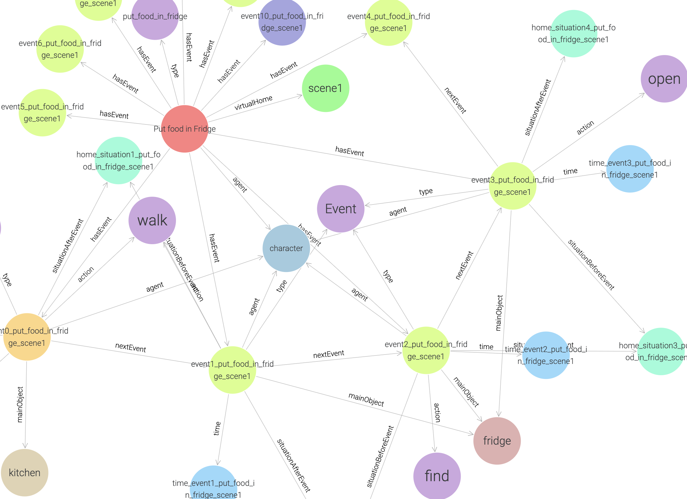

 [[Japanese](README_ja.md)]
 
 # Dataset for Knowledge Graph Reasoning Challenge for Social Issue
<table width="100%">
<tr>
<td width="49%"></td>
<td width="51%"></td>
</tr>
</table>

## Table of Contents
1. [Provided_Dataset](#Provided_Dataset)
2. [Dataset_Composition](#Dataset_Composition)
3. [Explanation of Knowledge Graphs](#Explanation_of_Knowledge_Graphs)
4. [How to Use Knowledge Graphs](#How_to_Use_Knowledge_Graphs)
5. [Creating Similar Knowledge Graphs](#Creating_Similar_Knowledge_Graphs)

## Provided_Dataset
- Video data that simulates daily life actions in a virtual space
- Data that turns the content of the videos into knowledge graphs ("who" did what "action" with what "object" and the resulting "state" or "position" of the object)
- This data is open to the public as open data.

## Dataset_Composition
- [Videos](./Movie)
  - mp4 format
  - 204 action scenarios (updated: 2023/02/21)
  - For each scenario, there is a character rear view (file name ending in 0), an indoor camera switching view (file name ending in 1), and a fixed camera view placed in each corner of the room (file name ending in 2-5). Also, for each action scenario, data was generated for a minimum of 1 to a maximum of 7 patterns with different room layouts (scenes). A total of 1,224 videos (updated: 2023/02/21)
  - Videos with slowly moving characters simulate the movements of elderly people.

- [Knowledge Graphs](./RDF)
  - RDF format
  - 204 knowledge graphs corresponding to the videos (updated: 2023/02/21)
  - Includes schema and location supplement information
  - The schema is described below
  - [SPARQL endpoints](https://kgrc4si.home.kg:7200/sparql) and [query examples](https://github.com/KnowledgeGraphJapan/KGRC-RDF/tree/kgrc4si#%E3%83%8A%E3%83%AC%E3%83%83%E3%82%B8%E3%82%B0%E3%83%A9%E3%83%95%E3%81%AE%E4%BD%BF%E7%94%A8%E6%96%B9%E6%B3%95) are available
- [Script Data](./Program)
  - txt format
  - Data provided to VirtualHome2KG to generate videos and knowledge graphs
  - Includes the action title and a brief description in text format.

## Explanation of Knowledge Graph
### Specification of Ontology
Please refer to the following specification for descriptions of all classes, instances, and properties:
https://aistairc.github.io/VirtualHome2KG/vh2kg_ontology.html

Below are explanations of representative classes and properties.

### Schema Diagram

<details>
<summary>Prefixes</summary>
<table>
    <tr>
        <td>Prefix</td>
        <td>URI</td>
    </tr>
    <tr>
        <td>:</td>
        <td>http://kgrc4si.home.kg/virtualhome2kg/ontology/</td>
    </tr>
    <tr>
        <td>ho:</td>
        <td>http://www.owl-ontologies.com/VirtualHome.owl#</td>
    </tr>
    <tr>
        <td>time:</td>
        <td>http://www.w3.org/2006/time#</td>
    </tr>
    <tr>
        <td>x3do</td>
        <td>https://www.web3d.org/specifications/X3dOntology4.0#</td>
    </tr>
</table>
</details>
<details>
<summary>Representative Classes</summary>
<table>
    <tr>
        <td>QName</td>
        <td>Description</td>
    </tr>
    <tr>
        <td>ho:Activity</td>
        <td>Human daily activities at home. This class is reused from the <a href="https://github.com/valexande/HomeOntology" target="_blank">HomeOntology</a>.</td>
    </tr>
    <tr>
        <td>:Event</td>
        <td>Smaller events that make up activities.</td>
    </tr>
    <tr>
        <td>:Action</td>
        <td>Human actions (or activities) performed within events.</td>
    </tr>
    <tr>
        <td>:Object</td>
        <td>Various objects found in the home, such as food, furniture, appliances, consumables, and household items.</td>
    </tr>
    <tr>
        <td>:Situation</td>
        <td>The state of the home at a specific moment. Instances of the state (State) of all objects in the home at that moment become part of an instance of this class (part).</td>
    </tr>
    <tr>
        <td>:State</td>
        <td>The state of a specific object at a specific moment. A new instance is only created when the state changes before and after the event.</td>
    </tr>
    <tr>
        <td>:StateType</td>
        <td>The type of state of an object. Instances of this class are based on the <a href="https://github.com/xavierpuigf/virtualhome/tree/master/src/virtualhome/simulation#object-states" target="_blank">object states</a> of VirtualHome.</td>
    </tr>
    <tr>
        <td>:Attribute</td>
        <td>Attributes of an object.</td>
    </tr>
<td>:Shape</td>
        <td>A class that represents the shape and position of an object, with values for size and coordinates in a 3D bounding box. This class is reused from the <a href="https://www.web3d.org/x3d/content/semantics/semantics.html" target="_blank">X3D ontology</a>.</td>
    </tr>
    <tr>
        <td>time:Duration</td>
        <td>The duration of an action in seconds. This class is reused from the <a href="https://www.w3.org/TR/owl-time/#time:Duration">Time Ontology</a>.</td>
    </tr>
</table>
</details>

<details>
<summary>Representative properties</summary>
<table>
    <tr>
        <td>QName</td>
        <td>Domains</td>
        <td>Ranges</td>
        <td>Description</td>
    </tr>
    <tr>
        <td>:activty</td>
        <td>:Character</td>
        <td>:Activity</td>
        <td>Associates a character (agent) with an activity.</td>
    </tr>
    <tr>
        <td>:action</td>
        <td>:Event</td>
        <td>:Action</td>
        <td>Associates an event with an action (motion). Activities are composed of sequences of actions.</td>
    </tr>
    <tr>
        <td>:eventNumber</td>
        <td>:Event</td>
        <td>xsd:int</td>
        <td>Indicates the order of events in an activity.</td>
    </tr>
    <tr>
        <td>:situationBeforeEvent</td>
        <td>:Event</td>
        <td>:Situation</td>
        <td>Associates an event with a situation. The household situation before some event is about to occur.</td>
    </tr>
    <tr>
        <td>:situationAfterEvent</td>
        <td>:Event</td>
        <td>:Situation</td>
        <td>Associates an event with a situation. The household situation after some event has occurred.</td>
    </tr>
    <tr>
        <td>:mainObject</td>
        <td>:Event</td>
        <td>:Object</td>
        <td>A sub-property of ho:object. Associates an event with its main object. This property is used when specifying the object that is acted upon in an event, for example, "object_X is actioned upon object_Y".</td>
    </tr>
    <tr>
        <td>:targetObject</td>
        <td>:Event</td>
        <td>:Object</td>
        <td>A sub-property of ho:object. Associates an event with its target object. This property is used when specifying the object that is acted upon in an event, for example, "object_X is actioned upon object_Y".</td>
    </tr>
    <tr>
        <td>time:hasDuration</td>
        <td>:Event</td>
        <td>time:Duration</td>
        <td>Associates an event with its duration.</td>
    </tr>
    <tr>
        <td>:isStateOf</td>
        <td>:State</td>
        <td>:Object</td>
        <td>Associates an object with its state.</td>
    </tr>
    <tr>
        <td>:state</td>
        <td>:State</td>
        <td>:StateType</td>
        <td>Associates a state with its value.</td>
    </tr>
    <tr>
        <td>:affords</td>
        <td>:Object</td>
        <td>:Action</td>
        <td>Associates an object with an action. Denotes the affordances of an object.</td>
    </tr>
    <tr>
        <td>:attribute</td>
        <td>:Object</td>
        <td>:Attribute</td>
        <td>Associates an object with an attribute.</td>
    </tr>
    <tr>
        <td>:partOf</td>
     <tr>
        <td>:partOf</td>
        <td>:State</td>
        <td>:Situation</td>
        <td>Indicates which momentary Situation a State of an object is part of, in the home.</td>
    </tr>
    <tr>
        <td>:bbox</td>
        <td>:State</td>
        <td>:Shape</td>
        <td>Relates the resource of the shape at a given moment of the State of an object.</td>
    </tr>
    <tr>
        <td>:nextActivity</td>
        <td>:Activity</td>
        <td>:Activity</td>
        <td>Indicates the relationship between two Activities. The next Activity.</td>
    </tr>
    <tr>
        <td>:nextEvent</td>
        <td>:Event</td>
        <td>:Event</td>
        <td>Indicates the relationship between two Events. The next Event.</td>
    </tr>
    <tr>
        <td>:nextSituation</td>
        <td>:Situation</td>
        <td>:Situation</td>
        <td>Indicates the relationship between two Situations. The next Situation.</td>
    </tr>
    <tr>
        <td>:nextState</td>
        <td>:State</td>
        <td>:State</td>
        <td>Indicates the relationship between two States of an object. The next State of the object.</td>
    </tr>
    <tr>
        <td>:between</td>
        <td>:Shape</td>
        <td>:Shape</td>
        <td>Primarily applies to door objects. Indicates the relationship between the door and the rooms it separates (e.g., door between kitchen and living room). Refer to VirtualHome's <a href="https://github.com/xavierpuigf/virtualhome/tree/master/src/virtualhome/simulation#relations" target="_blank">relations</a> for more details.</td>
    </tr>
    <tr>
        <td>:close</td>
        <td>:Shape</td>
        <td>:Shape</td>
        <td>Indicates that the distance between two objects is within 1.5 meters. Refer to VirtualHome's <a href="https://github.com/xavierpuigf/virtualhome/tree/master/src/virtualhome/simulation#relations" target="_blank">relations</a> for more details.</td>
    </tr>
    <tr>
        <td>:facing</td>
        <td>:Shape</td>
        <td>:Shape</td>
        <td>Indicates that an object 2 is visible from object 1. The center of the two objects must be within 5 meters of each other. Refer to VirtualHome's <a href="https://github.com/xavierpuigf/virtualhome/tree/master/src/virtualhome/simulation#relations" target="_blank">relations</a> for more details.</td>
    </tr>
    <tr>
        <td>:holds_lh</td>
        <td>:Shape</td>
        <td>:Shape</td>
        <td>Indicates that the object is held in the left hand. The subject is thus a Shape related to a Character. Refer to VirtualHome's <a href="https://github.com/xavierpuigf/virtualhome/tree/master/src/virtualhome/simulation#relations" target="_blank">relations</a> for more details.</td>
    </tr>
 <tr>
    <td>:holds_rh</td>
    <td>:Shape</td>
    <td>:Shape</td>
    <td>Indicates that the character is holding an object with their right hand. Therefore, the subject is the shape of the object related to the character. For more details, please refer to the VirtualHome "relations" section in <a href="https://github.com/xavierpuigf/virtualhome/tree/master/src/virtualhome/simulation#relations" target="_blank">https://github.com/xavierpuigf/virtualhome/tree/master/src/virtualhome/simulation#relations</a>.</td>
</tr>
<tr>
    <td>:inside</td>
    <td>:Shape</td>
    <td>:Shape</td>
    <td>Indicates that object 1 is located inside object 2. For more details, please refer to the VirtualHome "relations" section in <a href="https://github.com/xavierpuigf/virtualhome/tree/master/src/virtualhome/simulation#relations" target="_blank">https://github.com/xavierpuigf/virtualhome/tree/master/src/virtualhome/simulation#relations</a>.</td>
</tr>
<tr>
    <td>:on</td>
    <td>:Shape</td>
    <td>:Shape</td>
    <td>Indicates that object 1 is located on top of object 2.</td>
</tr>
 </table>
 </details>
 
### Explanation of a concrete Knowledge Graph

## How to use the Knowledge Graph
The Knowledge Graph is provided in RDF format, so it can be stored in a triplestore and various searches can be performed using the SPARQL query language. An SPARQL endpoint is also provided for direct use.

References:

- Reference material about Triple Stores.: [Introduction to Triplestores](https://www.slideshare.net/KnowledgeGraph/lod-250078657) (page 12)
- Reference materials on SPARQL: [Examples of SPARQL Queries using Wikidata](https://www.slideshare.net/KnowledgeGraph/linked-open-data2020-sparqlsparql) (page 16)
### SPARQL Endpoint
An SPARQL endpoint for this dataset is available at https://kgrc4si.home.kg:7200/sparql. Please select "KGRC4SIv03" as the repository (as of 2023/04/03). The triplestore used is Ontotext GraphDB. Please refer to this video for basic usage.

If this endpoint is down, please use the mirror repository provided by the Kozaki Laboratory at Osaka Electro-Communication University (http://kozaki-lab.osakac.ac.jp/agraph/kgrc4si). Note that it may not have the latest data.

### Examples of SPARQL Queries
- Retrieve a list of activities
- Retrieve events and actions in the "clean the kitchen" activity
- Frequently grasped objects
- List of types of objects that are interacted with
- Add height information for objects

#### Retrieve a list of activities
```sparql
PREFIX ex: <http://kgrc4si.home.kg/virtualhome2kg/instance/>
PREFIX : <http://kgrc4si.home.kg/virtualhome2kg/ontology/>
select DISTINCT * where {
    ?activity :virtualHome ex:scene1 .
}
```
[Results](https://kgrc4si.home.kg:7200/sparql?name=&infer=true&sameAs=false&query=PREFIX%20ex%3A%20%3Chttp%3A%2F%2Fkgrc4si.home.kg%2Fvirtualhome2kg%2Finstance%2F%3E%0APREFIX%20%3A%20%3Chttp%3A%2F%2Fkgrc4si.home.kg%2Fvirtualhome2kg%2Fontology%2F%3E%0Aselect%20DISTINCT%20*%20where%20%7B%0A%20%20%20%20%3Factivity%20%3AvirtualHome%20ex%3Ascene1%20.%0A%7D)

#### Retrieve events and actions in the "clean the kitchen" activity
```sparql
PREFIX ex: <http://kgrc4si.home.kg/virtualhome2kg/instance/>
PREFIX : <http://kgrc4si.home.kg/virtualhome2kg/ontology/>
select DISTINCT * where {
    ex:clean_kitchen_scene1 :hasEvent ?event .
    ?event :action ?action .
}
```
[Results](https://kgrc4si.home.kg:7200/sparql?name=&infer=true&sameAs=false&query=PREFIX%20ex%3A%20%3Chttp%3A%2F%2Fkgrc4si.home.kg%2Fvirtualhome2kg%2Finstance%2F%3E%0APREFIX%20%3A%20%3Chttp%3A%2F%2Fkgrc4si.home.kg%2Fvirtualhome2kg%2Fontology%2F%3E%0Aselect%20DISTINCT%20*%20where%20%7B%0A%20%20%20%20ex%3Aclean_kitchen_scene1%20%3AhasEvent%20%3Fevent%20.%0A%20%20%20%20%3Fevent%20%3Aaction%20%3Faction%20.%0A%7D)

#### List of types of objects that are interacted with
```sparql
PREFIX : <http://kgrc4si.home.kg/virtualhome2kg/ontology/>
select distinct ?objectType where { 
    ?event (:mainObject|:targetObject) ?object .
    ?object a ?objectType .
}
```
[Results](https://kgrc4si.home.kg:7200/sparql?name=&infer=true&sameAs=false&query=PREFIX%20%3A%20%3Chttp%3A%2F%2Fkgrc4si.home.kg%2Fvirtualhome2kg%2Fontology%2F%3E%0Aselect%20distinct%20%3FobjectType%20where%20%7B%20%0A%20%20%20%20%3Fevent%20(%3AmainObject%7C%3AtargetObject)%20%3Fobject%20.%0A%20%20%20%20%3Fobject%20a%20%3FobjectType%20.%0A%7D)

#### Frequently grasped objects
```sparql
PREFIX ho: <http://www.owl-ontologies.com/VirtualHome.owl#>
PREFIX rdfs: <http://www.w3.org/2000/01/rdf-schema#>
PREFIX : <http://kgrc4si.home.kg/virtualhome2kg/ontology/>
PREFIX dcterms: <http://purl.org/dc/terms/>
PREFIX ac: <http://kgrc4si.home.kg/virtualhome2kg/ontology/action/>
select ?name (count(?object) AS ?count) where { 
	?objectClass rdfs:subClassOf :Object .
    ?object a ?objectClass ;
            rdfs:label ?label ; 
            dcterms:identifier ?id .
    ?event ho:object ?object .
    ?event :action ac:grab .
    BIND(concat(?label, ?id) AS ?name)
} group by ?object ?name order by desc(count(?object))
```
[Results](https://kgrc4si.home.kg:7200/sparql?name=&infer=true&sameAs=false&query=PREFIX%20ho%3A%20%3Chttp%3A%2F%2Fwww.owl-ontologies.com%2FVirtualHome.owl%23%3E%0APREFIX%20rdfs%3A%20%3Chttp%3A%2F%2Fwww.w3.org%2F2000%2F01%2Frdf-schema%23%3E%0APREFIX%20%3A%20%3Chttp%3A%2F%2Fkgrc4si.home.kg%2Fvirtualhome2kg%2Fontology%2F%3E%0APREFIX%20dcterms%3A%20%3Chttp%3A%2F%2Fpurl.org%2Fdc%2Fterms%2F%3E%0APREFIX%20ac%3A%20%3Chttp%3A%2F%2Fkgrc4si.home.kg%2Fvirtualhome2kg%2Fontology%2Faction%2F%3E%0Aselect%20%3Fname%20(count(%3Fobject)%20AS%20%3Fcount)%20where%20%7B%20%0A%09%3FobjectClass%20rdfs%3AsubClassOf%20%3AObject%20.%0A%20%20%20%20%3Fobject%20a%20%3FobjectClass%20%3B%0A%20%20%20%20%20%20%20%20%20%20%20%20rdfs%3Alabel%20%3Flabel%20%3B%20%0A%20%20%20%20%20%20%20%20%20%20%20%20dcterms%3Aidentifier%20%3Fid%20.%0A%20%20%20%20%3Fevent%20ho%3Aobject%20%3Fobject%20.%0A%20%20%20%20%3Fevent%20%3Aaction%20ac%3Agrab%20.%0A%20%20%20%20BIND(concat(%3Flabel%2C%20%3Fid)%20AS%20%3Fname)%0A%7D%20group%20by%20%3Fobject%20%3Fname%20order%20by%20desc(count(%3Fobject)))

#### Add height information for objects
```sparql
PREFIX x3do: <https://www.web3d.org/specifications/X3dOntology4.0#>
PREFIX rdf: <http://www.w3.org/1999/02/22-rdf-syntax-ns#>
PREFIX : <http://kgrc4si.home.kg/virtualhome2kg/ontology/>
PREFIX ex: <http://kgrc4si.home.kg/virtualhome2kg/instance/>
CONSTRUCT {
    ?object :height ?height_node .
    ?height_node rdf:value ?size_y1 ;
           :unit :meter .
} WHERE {
	?state1 :isStateOf ?object ; :bbox ?shape1 .
	?shape1 x3do:bboxSize ?size1 .
	?size1 rdf:rest ?size_y .
    ?size_y rdf:first ?size_y1 .
    BIND(REPLACE(STR(?object), STR(ex:) ,"") AS ?object_name)
    BIND(URI(CONCAT(STR(ex:),"height_", ?object_name)) AS ?height_node)
}
```
[Results](https://kgrc4si.home.kg:7200/sparql?name=&infer=false&sameAs=false&query=PREFIX%20x3do%3A%20%3Chttps%3A%2F%2Fwww.web3d.org%2Fspecifications%2FX3dOntology4.0%23%3E%0APREFIX%20rdf%3A%20%3Chttp%3A%2F%2Fwww.w3.org%2F1999%2F02%2F22-rdf-syntax-ns%23%3E%0APREFIX%20%3A%20%3Chttp%3A%2F%2Fkgrc4si.home.kg%2Fvirtualhome2kg%2Fontology%2F%3E%0APREFIX%20ex%3A%20%3Chttp%3A%2F%2Fkgrc4si.home.kg%2Fvirtualhome2kg%2Finstance%2F%3E%0ACONSTRUCT%20%7B%0A%20%20%20%20%3Fobject%20%3Aheight%20%3Fheight_node%20.%0A%20%20%20%20%3Fheight_node%20rdf%3Avalue%20%3Fsize_y1%20%3B%0A%20%20%20%20%20%20%20%20%20%20%20%3Aunit%20%3Ameter%20.%0A%7D%20WHERE%20%7B%0A%09%3Fstate1%20%3AisStateOf%20%3Fobject%20%3B%20%3Abbox%20%3Fshape1%20.%0A%09%3Fshape1%20x3do%3AbboxSize%20%3Fsize1%20.%0A%09%3Fsize1%20rdf%3Arest%20%3Fsize_y%20.%0A%20%20%20%20%3Fsize_y%20rdf%3Afirst%20%3Fsize_y1%20.%0A%20%20%20%20BIND(REPLACE(STR(%3Fobject)%2C%20STR(ex%3A)%20%2C%22%22)%20AS%20%3Fobject_name)%0A%20%20%20%20BIND(URI(CONCAT(STR(ex%3A)%2C%22height_%22%2C%20%3Fobject_name))%20AS%20%3Fheight_node)%0A%7D)

### How to create a similar knowledge graph
This dataset was created using our proposed system "[VirtualHome2KG](https://github.com/aistairc/VirtualHome2KG/blob/main/README.md)."
For more information, please refer to this document.

## References
- Egami, S., Ugai, T., Oono, M., Kitamura, K., Fukuda.: Synthesizing Event-centric Knowledge Graphs of Daily Activities using Virtual Space. IEEE Access, Vol. 11, pp.23857-23873. doi: [https://doi.org/10.1109/ACCESS.2023.3253807](https://doi.org/10.1109/ACCESS.2023.3253807) (2023)
- Egami, S., Nishimura, S., Fukuda, K.: A Framework for Constructing and Augmenting Knowledge Graphs using Virtual Space: Towards Analysis of Daily Activities. Proceedings of the 33rd IEEE International Conference on Tools with Artificial Intelligence. pp.1226-1230 (2021) [[IEEE Xplore]](https://ieeexplore.ieee.org/document/9643400)
- Egami, S., Nishimura, S., Fukuda, K.: VirtualHome2KG: Constructing and Augmenting Knowledge Graphs of Daily Activities Using Virtual Space. Proceedings of the ISWC 2021 Posters, Demos and Industry Tracks: From Novel Ideas to Industrial Practice, co-located with 20th International Semantic Web Conference. CEUR, Vol.2980 (2021) [[pdf]](http://ceur-ws.org/Vol-2980/paper381.pdf)
- 江上周作，鵜飼孝典，Swe Nwe Nwe Htun，太田雅輝，大野美喜子，北村光司，松下京群，古崎晃司，川村隆浩，福田賢一郎: 家庭内の日常生活動画とイベント中心知識グラフの同時生成，2023年度人工知能学会全国大会（第37回）, (2023) (In Japanese) 
- 江上周作，鵜飼孝典，窪田文也，大野美喜子，北村光司，福田賢一郎: 家庭内の事故予防に向けた合成ナレッジグラフの構築と推論，第56回人工知能学会セマンティックウェブとオントロジー研究会, SIG-SWO-056-14 (2022) [[J-STAGE]](https://www.jstage.jst.go.jp/article/jsaisigtwo/2022/SWO-056/2022_14/_article/-char/ja)(In Japanese)

## License
<a rel="license" href="http://creativecommons.org/licenses/by/4.0/"></a><br /><a xmlns:cc="http://creativecommons.org/ns#" href="https://profile.idease.info/" property="cc:attributionName" rel="cc:attributionURL">Shusaku Egami</a> and others created "<span xmlns:dct="http://purl.org/dc/terms/" href="http://purl.org/dc/dcmitype/Dataset" property="dct:title" rel="dct:type">VirtualHome2KG dataset - simulation videos and knowledge graphs of daily activities in a household</span>" which is licensed under a <a rel="license" href="http://creativecommons.org/licenses/by/4.0/">Creative Commons Attribution 4.0 International License</a>.<br />Based on the work available at <a xmlns:dct="http://purl.org/dc/terms/" href="https://github.com/aistairc/VirtualHome2KG" rel="dct:source">https://github.com/aistairc/VirtualHome2KG</a>.

## Acknowledge
This product is based on results obtained from a project, JPNP20006 and JPNP180013, commissioned by the New Energy and Industrial Technology Development Organization (NEDO).
